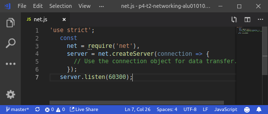
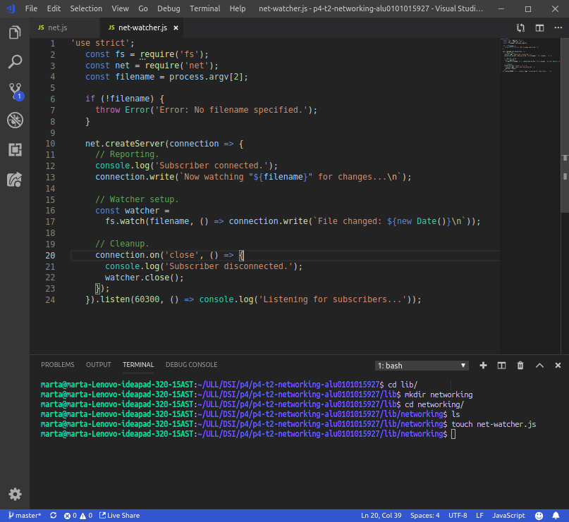
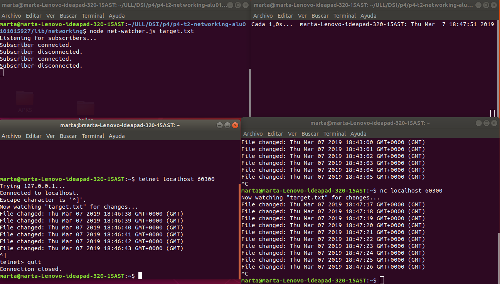
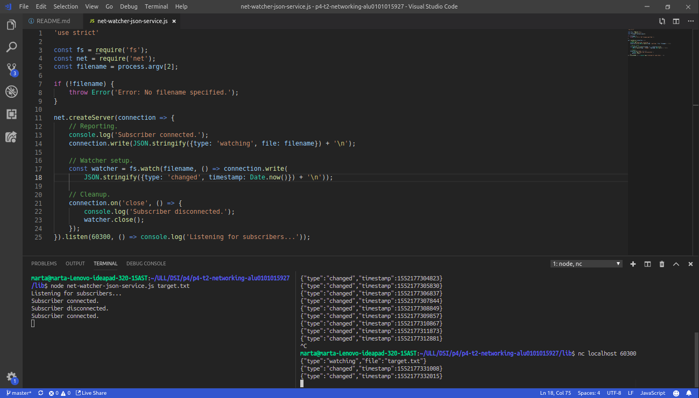
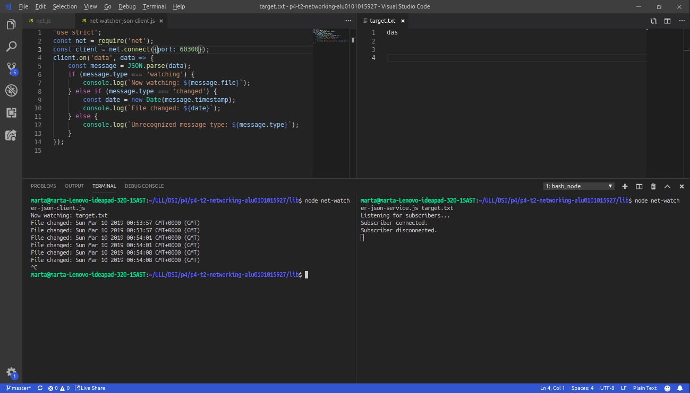
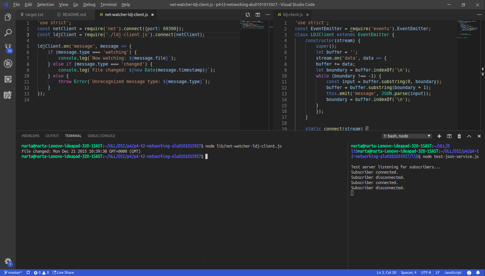

# p4-t2-networking-alu0101015927
p4-t2-networking-alu0101015927 created by GitHub Classroom

Apuntes del capíturo 3, Node.js 8 the Right way.

## Redes con Sockets

Node.js fue diseñado desde cero para hacer programación en red.  Los sockets TCP forman la columna vertebral de las aplicaciones en red modernas. 

 ### Escucha de conexiones por Sockets
 
 Escucha de conexiones de zócalo

Los servicios en red existen para hacer dos cosas: conectar puntos finales y transmitir información entre ellos. No importa qué tipo de información se transmita, primero se debe hacer una conexión.

#### Enlazando un servidor a un puerto TCP
 
Las conexiones de socket TCP constan de dos puntos finales. Un punto extremo se enlaza a un puerto numerado, mientras que el otro punto extremo se conecta a un puerto.
 
En Node.js, las operaciones de enlace y conexión son proporcionadas por el módulo net. El enlace de un puerto TCP para escuchar conexiones es de la siguiente manera:



El método net.createServer toma una función de devolución de llamada y devuelve un objeto Servidor. Node.js invocará la función de devolución de llamada cuando se conecte otro punto final. El parámetro de conexión es un objeto Socket que puede utilizar para enviar o recibir datos.

Al llamar a server.listen se une el puerto especificado. En este caso, estamos vinculando el número de puerto TCP 60300.

Nuestro programa de servidor no hace nada con la conexión todavía. Vamos a arreglar eso usándolo para enviar alguna información útil al cliente.

#### Escribiendo datos por un Socket 

Crearemos un directorio llamado networking para guardar el código que escribiremos. Luego en el editor escribiremos lo siguiente:



Podemos ver que en la parte superior hemos incluido los módulos principales de Node.js fs y net.

El nombre del archivo a observar, si se proporcionase, sería el tercer argumento (índice 2) en process.argv. Si el usuario no proporcionase un archivo lanzamos un Error personalizado. Los errores no detectados harán que el proceso Node.js se detenga después de enviar un seguimiento de pila a un error estándar.

Si miramos la función createServer podemos ver que su llamada devuelve tres cosas:

- Informa que la conexión se ha establecido (tanto para el cliente con connection.write como para la consola).
- Comienza a escuchar los cambios en el archivo de destino, guardando el objeto de observador devuelto. Esta devolución de llamada envía información de cambio al cliente usando connection.write.
- Escucha el evento de cierre de la conexión para poder informar que el suscriptor se ha desconectado y dejar de ver el archivo, con watcher.close.

Finalmente, la devolución de llamada pasa a server.listen al final. Node.js invoca esta función después de que haya enlazado con éxito el puerto 60300 y esté listo para comenzar a recibir conexiones.

#### Conectandonos a un Servidor Socket TCP con Netcat 

Para ejecutar y probar el programa net-watcher, necesitará tres sesiones de terminal: una para el servicio en sí, una para el cliente y otra para activar los cambios en el archivo visto.

En la primera terminal usamos el comando watch para tocar el archivo de destino a intervalos de un segundo.

 	​$ ​​watch​​ ​​-n​​ ​​1​​ ​​touch​​ ​​target.txt​

Mientras esto se ejecuta, en la segunda terminal ejecutamos el programa net-watcher:

	​$ ​​node​​ ​​net-watcher.js​​ ​​target.txt​ ​ 	Listening for subscribers...

Este programa crea un servicio escuchando en el puerto TCP 60300. Para conectarnos a él usaremos netcat, un programa que utiliza socket. Abrimos una tercera terminal y usamos el comando nc:

 	​$ ​​nc​​ ​​localhost​​ ​​60300​
	​ Now watching "target.txt" for changes...
	​ File changed: Wed Dec 16 2015 05:56:14 GMT-0500 (EST)
	​ File changed: Wed Dec 16 2015 05:56:19 GMT-0500 (EST)

si en tu sistema no tienes nc puedes usar telnet:

 	​$ ​​telnet​​ ​​localhost​​ ​​60300​
	​ Trying 127.0.0.1...
	​ Connected to localhost.
	​ Escape character is '^]'.
	​ Now watching "target.txt" for changes...
	​ File changed: Wed Dec 16 2015 05:56:14 GMT-0500 (EST)
	​ File changed: Wed Dec 16 2015 05:56:19 GMT-0500 (EST)
	​ ^]
	​ ​telnet>​​ ​​quit​
	​ Connection closed.

En la terminal de net-watcher se verá el mensaje Subscriber connected.
Puede matar la sesion de nc con Ctrl-c. Si estas usando telnet, Ctrk-] y luego quit. Podrás ver que en la terminal de net-watcher aparece	Subscriber disconnected.

Para terminar el servicio net-watcher o el comando watch usamos Ctrl-c.

Múltiples subscriptores podrán conectarse y recibir actualizaciones simultaneamente. Si abrimos una terminal y nos comectamos al mismo puerto con nc recibiremos las actualizaciones cuando el fichero se cambie.

Los sockets TCP son útiles para la comunicación entre equipos conectados en red. Pero si necesita procesos en la misma computadora para comunicarse, los sockets Unix ofrecen una alternativa más eficiente. El módulo de red también puede crear este tipo de socket.



#### Escuchando en Sockets Unix 

Modificaremos el programa net-watcher para ver como funciona el módulo de red que usan los sockets de Unix.
Estos solo funcionan en entornos similares a Unix.

Cambianos .linten por .listen('/tmp/watcher.sock', () => console.log('Listening for subscribers...'));

Si obtiene un error que contiene EADDRINUSE, es posible que deba eliminar watcher.sock antes de ejecutar el programa nuevamente.

Para conectar un cliente podemos usar nc pero esta vez especificando la marca -U para usar el archivo de socket.


Los sockets Unix pueden ser más rápidos que los sockets TCP porque no requieren invocar hardware de red. Sin embargo, por naturaleza están confinados a la máquina.

### Implementando un protocolo de mensajeria

Un protocolo es un conjunto de reglas que define cómo se comunican los puntos finales en un sistema. Cada vez que desarrolle una aplicación en red en Node.js, estará trabajando con uno o más protocolos. Crearemos un protocolo basado en pasar mensajes JSON a través de TCP.

JSON es increíblemente frecuente en Node.js. Lo utilizaremos ampliamente para la serialización y configuración de datos. Es mucho más fácil programar a los clientes en comparación con el texto simple, y aún es legible para los humanos.

Implementaremos puntos finales de cliente y servidor que usen nuestro nuevo protocolo basado en JSON. Esto nos dará la oportunidad de desarrollar casos de prueba y refactorizar nuestro código en módulos reutilizables.

#### Serialización de mensajes JSON

Vamos a desarrollar el protocolo de paso de mensajes que utiliza JSON para serializar los mensajes. Cada mensaje es un objeto serializado JSON, que es un hash de pares clave-valor. Aquí hay un ejemplo de objeto JSON con dos pares clave-valor:

	{"Clave": "valor", "otraClave": "otroValor"}

El servicio net-watcher que hemos estado desarrollando envía dos tipos de mensajes que necesitamos convertir a JSON:

 - Cuando se establece la conexión por primera vez, el cliente recibe la cadena _Now watching "target.txt" for changes...._

 - Cuando el archivo de destino cambia, el cliente recibe una cadena como esta: _File changed: Fri Dec 18 2015 05:44:00 GMT-0500 (EST)._

Codificaremos el primer tipo de mensaje de esta manera:

 	{​"type"​:​"watching"​,​"file"​:​"target.txt"​}

El campo de tipo indica que este es un mensaje de observación: el archivo especificado ahora se está viendo.

El segundo tipo de mensaje se codifica de esta manera:

	{"Tipo": "cambiado", "marca de tiempo": 1358175733785}

Aquí el campo de tipo anuncia que el archivo de destino ha cambiado. El campo de marca de tiempo contiene un valor entero que representa el número de milisegundos desde la medianoche del 1 de enero de 1970. Este es un formato de hora fácil para trabajar en JavaScript. Por ejemplo, puede obtener la hora actual en este formato con Date.now.

No hay saltos de línea en nuestros mensajes JSON. Aunque JSON es independiente del espacio en blanco (ignora los espacios en blanco que están fuera de los valores de cadena), nuestro protocolo utilizará nuevas líneas solo para separar los mensajes. Nos referiremos a este protocolo como JSON delimitado por líneas (LDJ).

#### Cambiando a mensajes JSON

Ahora que hemos definido un protocolo mejorado y accesible por computadora, modifiquemos el servicio de net-watcher para usarlo. Luego crearemos programas cliente que recibirán e interpretarán estos mensajes.

Nuestra tarea es usar JSON.stringify para codificar objetos de mensaje y enviarlos a través de connection.write. JSON.stringify toma un objeto de JavaScript y devuelve una cadena que contiene una representación serializada de ese objeto en forma JSON.

En nuestro programa net-watcher.js reemplazaremos la línea:

	Connection.write (`Ahora mira" $ {filename} "para ver los cambios ... \ n`);

por:

	Connection.write (JSON.stringify ({type: 'watching', file: filename)) + '\ n');

Tambien reemplazaremos la llamada a connection.write dentro del observador:

	Vigilante de const =
	Fs.watch (filename, () => connection.write (`Archivo cambiado: $ {new Date ()} \ n`));

por lo siguiente:
	
	Const watcher = fs.watch (nombre de archivo, () => connection.write (
	JSON.stringify ({type: 'changed', timestamp: Date.now ()}) + '\ n'));

Ejecutaremos este nuevo fichero de la siguiente manera: 

	$ Node net-watcher-json-service.js target.txt
	Escuchando a los suscriptores ...

Luego nos conectaremos usando netcat desde un segundo terminal:
	
	$ Nc localhost 60300
	{"Tipo": "viendo", "archivo": "target.txt"}

Cuando tocas el archivo target.txt, verás una salida como esta de tu cliente:
	
	{"Tipo": "cambiado", "marca de tiempo": 1450437616760}



[link código net-watcher-json-service.js](lib/net-watcher-json-service.js)

Ahora estamos listos para escribir un programa cliente que procesa estos mensajes.


### Creación de conexiones Cliente Socket

Escribiremos un programa cliente en Node.js para recibir mensajes JSON de nuestro programa net-watcher-json-service. 

``` Node.js 
'use strict';
const net = require('net');
const client = net.connect({port: 60300});
client.on('data', data => {
    const message = JSON.parse(data);
    if (message.type === 'watching') {
        console.log(`Now watching: ${message.file}`);
    } else if (message.type === 'changed') {
        const date = new Date(message.timestamp);
        console.log(`File changed: ${date}`);
    } else {
        console.log(`Unrecognized message type: ${message.type}`);
    }
});
```
[link código net-watcher-json-client.js](lib/net-watcher-json-client.js)

Este programa utiliza net.connect para crear una conexión de cliente al puerto 60300 de localhost, luego espera los datos. El objeto cliente es un Socket, al igual que la conexión entrante que vimos en el lado del servidor.

Cada vez que ocurre un evento de datos, nuestra función de devolución de llamada toma el objeto de búfer entrante, analiza el mensaje JSON y luego registra un mensaje apropiado en la consola.

Para ejecutar el programa, primero ejecutamos net-watcher-json-service. Luego, en otro terminal, ejecutamos el cliente:

	​$ ​​node​​ ​​net-watcher-json-client.js​  
	​ Now watching: target.txt

Si tocamos el archivo de destino, la salida será como esta:

	​ File changed: Mon Dec 21 2015 05:34:19 GMT-0500 (EST)





Este programa funciona pero solo escucha eventos de datos, no eventos finales o eventos de error. Podríamos escuchar estos eventos y tomar las medidas apropiadas cuando ocurren.


### Probando la funcionalidad de la aplicación de red

Las pruebas funcionales nos aseguran que nuestro código hace lo que esperamos que haga. 

#### Entendiendo el problema del límite del mensaje

Cuando desarrollamos programas en red en Node.js, a menudo se comunican pasando mensajes. En el mejor de los casos, un mensaje llegará a la vez. Pero a veces los mensajes llegarán en pedazos, divididos en distintos eventos de datos. Para desarrollar aplicaciones en red, debemos lidiar con estas divisiones cuando ocurran.

El protocolo LDJ que desarrollamos anteriormente separa los mensajes con caracteres de nueva línea (\n). Cada carácter de nueva línea es el límite entre dos mensajes.

En el servicio que hemos estado desarrollando cada vez que ocurre un cambio, codifica y envía un mensaje a la conexión, incluida la nueva línea final. Cada línea de salida corresponde a un solo evento de datos en el cliente conectado. O, para decirlo de otra manera, los límites del evento de datos coinciden exactamente con los límites del mensaje.

Nuestro programa de cliente actualmente se basa en este comportamiento. Analiza cada mensaje enviando el contenido del búfer de datos directamente a JSON.parse:

	Cliente.on ('datos', datos => {
	Mensaje const = JSON.parse (datos);

Pero un mensaje se puede dividir por la mitad y llegar como dos eventos de datos separados, sobre todo si se trata de un mensaje grande. 


#### Implementando un servicio de prueba

Escribir aplicaciones robustas de Node.js requiere manejar problemas de red como entradas divididas, conexiones rotas y datos erróneos. Implementaremos un servicio de prueba que divide un mensaje a propósito en múltiples partes:

``` Node.js 
'use strict';
const server = require('net').createServer(connection => {
  console.log('Subscriber connected.');

  // Two message chunks that together make a whole message.
  const firstChunk = '{"type":"changed","timesta';
  const secondChunk = 'mp":1450694370094}\n';

  // Send the first chunk immediately.
  connection.write(firstChunk);

  // After a short delay, send the other chunk.
  const timer = setTimeout(() => {
    connection.write(secondChunk);
    connection.end();
  }, 100);

  // Clear timer when the connection ends.
  connection.on('end', () => {
    clearTimeout(timer);
    console.log('Subscriber disconnected.');
  });
});

server.listen(60300, function() {
  console.log('Test server listening for subscribers...');
});
```
[link código test-json-service.js](lib/test-json-service.js)

Lo ejecutaremos de la siguiente manera:

	​ ​$ ​​node​​ ​​test-json-service.js​
	​ Test server listening for subscribers...

Este servicio de prueba difiere de nuestro anterior net-watcher-json-service.js en algunos aspectos. En lugar de configurar un observador del sistema de archivos, como hicimos para el servicio real, aquí solo enviamos el primer fragmento predeterminado de inmediato.

Luego configuramos un temporizador para enviar el segundo fragmento después de un breve retraso. La función de JavaScript setTimeout toma dos parámetros: una función para invocar y una cantidad de tiempo en milisegundos. Después de la cantidad de tiempo especificada, la función será llamada.

Finalmente, cada vez que finaliza la conexión, usamos clearTimeout para cancelar la programación de la devolución de llamada. No es necesario programar la devolución de llamada porque una vez que se cierra la conexión, cualquier llamada a connection.write desencadenará eventos de error.

Finalmente, averigüemos qué sucede cuando nos conectamos con el programa cliente:

 	​$ ​​node​​ ​​net-watcher-json-client.js​
	​ undefined:1
	​ {"type":"changed","timesta
	​                    ^
	​ 
	​ SyntaxError: Unexpected token t
	​     at Object.parse (native)
	​     at Socket.<anonymous> (./net-watcher-json-client.js:6:22)
	​     at emitOne (events.js:77:13)
	​     at Socket.emit (events.js:169:7)
	​     at readableAddChunk (_stream_readable.js:146:16)
	​     at Socket.Readable.push (_stream_readable.js:110:10)
	​     at TCP.onread (net.js:523:20)

El error 'Unexpected token t' nos dice que el mensaje no fue completo y JSON válido. Nuestro cliente intentó enviar la mitad de un mensaje a JSON.parse, que solo espera cadenas JSON completas y con el formato correcto como entrada.


Hemos simulado con éxito el caso de un mensaje dividido proveniente del servidor. 


### Ampliación de clases principales en módulos personalizados

El programa Node.js de la sección anterior expuso una falla en nuestro código de cliente; a saber, que no amortigua sus entradas. Cualquier mensaje que llegue como múltiples eventos de datos lo bloqueará.

Así que realmente el programa cliente tiene dos tareas que hacer. Una es almacenar los datos entrantes en mensajes. La otra es manejar cada mensaje cuando llega.

En lugar de agrupar estos dos trabajos en un programa Node.js, lo correcto es convertir al menos uno de ellos en un módulo Node.js. Crearemos un módulo que maneje la parte del buffer de entrada para que el programa principal pueda recibir mensajes completos de manera confiable. A lo largo del camino, tendremos que hablar sobre los módulos personalizados y la extensión de las clases centrales en Node.

#### Extendiendo EventEmitter

Para liberar al programa cliente del peligro de dividir los mensajes JSON, implementaremos un módulo de cliente de búfer LDJ. Luego lo incorporaremos al cliente de Network Watcher.

##### Herencia en el nodo

Primero veamos cómo Node.js hace la herencia. El siguiente código configura LDJClient para heredar de EventEmitter.

``` Node.js

	​const​ EventEmitter = require(​'events'​).EventEmitter;
	​class​ LDJClient ​extends​ EventEmitter {
		​constructor​(stream) {
			super();
		}
	}

```
[link al código](lib/ldj-client.js)

LDJClient es una clase, lo que significa que otro código debe llamar a un nuevo LDJClient(stream) para obtener una instancia. El parámetro de flujo es un objeto que emite eventos de datos, como una conexión Socket.

Dentro de la función constructora, primero llamamos a super para invocar la función constructora propia de EventEmitter. Siempre que se esté implementando una clase que amplíe a otra clase, debes comenzar por llamar a super, con los argumentos de constructor apropiados para ello.

JavaScript utiliza la herencia prototípica para establecer la relación entre LDJClient y EventEmitter. La herencia prototípica es poderosa y se puede usar para más que solo clases, pero este uso es cada vez más raro. El código para utilizar "LDJClient" podría tener este aspecto:

``` Node.js 
​ 	​const​ client = ​new​ LDJClient(networkStream);
​ 	client.on(​'message'​, message => {
​ 	  ​// Take action for this message.​
​ 	});
``` 

Faltaría implementar la emitición de eventos de mensajes.

#### Eventos de datos de buffering

Es hora de usar el parámetro de flujo en el LDJClient para recuperar y almacenar la entrada. El objetivo es tomar los datos en bruto entrantes del flujo y convertirlos en eventos de mensaje que contengan los objetos de mensaje analizados.

El siguiente código es la actualización del constructor. Anexa fragmentos de datos entrantes a una cadena de búfer en ejecución y explora los finales de línea (que deben ser los límites de los mensajes JSON).

``` Node.js 
 	​constructor​(stream) {
​ 	  ​super​();
​ 	  ​let​ buffer = ​''​;
​ 	  stream.on(​'data'​, data => {
​ 	    buffer += data;
​ 	    ​let​ boundary = buffer.indexOf(​'​​\​​n'​);
​ 	    ​while​ (boundary !== -1) {
​ 	      ​const​ input = buffer.substring(0, boundary);
​ 	      buffer = buffer.substring(boundary + 1);
​ 	      ​this​.emit(​'message'​, JSON.parse(input));
​ 	      boundary = buffer.indexOf(​'​​\​​n'​);
​ 	    }
​ 	  });
​ 	}
````
[link código ldj-clients.js](lib/ldj-client.js)

***
#### Herencia prototípica

Considerando la clase LDJClient que acabamos de hacer. Antes de la disponibilidad de la clase, el constructor y las súper palabras clave, habríamos escrito ese código de la siguiente manera:

	Const EventEmitter = require ('events') .EventEmitter;
	Const util = require ('util');
		
	Función LDJClient (flujo) {
	EventEmitter.call (este);
	}
	
	Util.inherits (LDJClient, EventEmitter);

LDJClient es una función constructora. Es lo mismo que si hubiesemos usado las palabras clave de clase y constructor. En lugar de super, invocamos la función constructora EventEmitter.

Finalmente, usamos util.inherits para hacer que el objeto principal prototípico de LDJClient sea el prototipo EventEmitter, es decir, si busca una propiedad en un LDJClient y no está allí, EventEmitter es el siguiente lugar para buscar.

Cuándo hacemos una instancia de LDJClient se llama a la instancia del cliente y llamamos a client.on. Aunque el objeto cliente en sí y el prototipo LDJClient carecen de un método on, el motor JavasScript buscará y usará el método on de EventEmitter.

De la misma manera, si llamamos a client.toString, el motor de JavaScript encontrará y utilizará la implementación nativa en el objeto primario prototípico del EventEmitter, Object.

En general, no deberíamos tener que lidiar con este nivel de abstracción. El uso más común de la herencia prototípica es configurar jerarquías de clases.

***

Comenzamos llamando a super, como antes, y luego configuramos una variable de cadena llamada buffer para capturar los datos entrantes. A continuación, usamos stream.on para manejar eventos de datos.

El código dentro del controlador de eventos de datos es denso, pero no es sofisticado. Agregamos datos sin procesar al final del búfer y luego buscamos los mensajes completos desde el frente. Cada cadena de mensaje se envía a través de JSON.parse y, finalmente, es emitida por el LDJClient como un evento de mensaje a través de this.emit.

En este punto, el problema con el que comenzamos (el manejo de mensajes divididos) se resuelve de manera efectiva. Ya sea que aparezcan diez mensajes en un solo evento de datos o solo la mitad de uno, todos precipitarán eventos de mensaje en la instancia de LDJClient.

A continuación, debemos colocar esta clase en un módulo Node.js para que nuestro cliente de nivel superior pueda usarla.

#### Funcionalidad de exportación en un módulo

Pongamos LDJClient como un módulo. Para ello creamos un directorio llamado lib. Este nombre se debe a que hay una convención fuerte en la comunidad Node.js para poner código de soporte en el directorio lib.

``` Node.js 
 	​'use strict'​;
​ 	​const​ EventEmitter = require(​'events'​).EventEmitter;
​ 	​class​ LDJClient ​extends​ EventEmitter {
​ 	  ​constructor​(stream) {
​ 	    super​();
​ 	    ​let​ buffer = ​''​;
​ 	    stream.on(​'data'​, data => {
​ 	      buffer += data;
​ 	      ​let​ boundary = buffer.indexOf(​'​​\​​n'​);
​ 	      ​while​ (boundary !== -1) {
​ 	        ​const​ input = buffer.substring(0, boundary);
​ 	        buffer = buffer.substring(boundary + 1);
​ 	        ​this​.emit(​'message'​, JSON.parse(input));
​ 	        boundary = buffer.indexOf(​'​​\​​n'​);
​ 	      }
​ 	    });
​ 	  }
​ 	
​ 	  ​static​ connect(stream) {
​ 	    ​return​ ​new​ LDJClient(stream);
​ 	  }
​ 	}
​ 	
​ 	module.exports = LDJClient;```

``` 
[link código ldj-client.js](lib/ldj-client.js)

El código para este módulo es la combinación de ejemplos anteriores más un método estático: la nueva sección module.exports al final.

Dentro de la definición de clase, después del constructor, estamos agregando un método estático llamado connect. Se adjunta un método estático a la propia clase LDJClient en lugar de aplicarse a instancias individuales. El método de conexión es simplemente una conveniencia para los consumidores de la biblioteca para que no tengan que usar el nuevo operador para crear una instancia de LDJClient.

En un módulo Node.js, el objeto module.exports es el puente entre el código del módulo y el mundo exterior. Todas las propiedades que establezca en las exportaciones estarán disponibles para el código ascendente que se extrae en el módulo. En nuestro caso, estamos exportando la propia clase LDJClient.

El código para usar el módulo LDJ se verá así:

	Const LDJClient = require ('./lib/ldj-client.js');
	Cliente const = nuevo LDJClient (networkStream);

O, usando el método de conexión, podría verse así:

	Const client = require ('./lib/ldj-client.js') .connect (networkStream);

En ambos casos, la función require toma una ruta real en lugar de los nombres abreviados de módulos que hemos visto anteriormente, como fs, net y util. Cuando se proporciona una ruta que requiere, Node.js intentará resolver la ruta relativa al archivo actual.

#### Importando un Módulo Node.js personalizado

Para utilizar nuestro módulo personalizado modifiquemos el cliente para usarlo en lugar de leer directamente desde el stream TCP.

``` Node.js
 	​'use strict'​;
​ 	​const​ netClient = require(​'net'​).connect({port: 60300});
​ 	​const​ ldjClient = require(​'./lib/ldj-client.js'​).connect(netClient);
​ 	
​ 	ldjClient.on(​'message'​, message => {
​ 	  ​if​ (message.type === ​'watching'​) {
​ 	    console.log(​`Now watching: ​${message.file}​`​);
​ 	  } ​else​ ​if​ (message.type === ​'changed'​) {
​ 	    console.log(​`File changed: ​${​new​ Date(message.timestamp)}​`​);
​ 	  } ​else​ {
​ 	    ​throw​ Error(​`Unrecognized message type: ​${message.type}​`​);
​ 	  }
​ 	});

```
[link código net-watcher-ldj-client.js](lib/net-watcher-ldj-client.js)

Es similar a nuestro net-watcher-json-client de Crear conexiones de cliente de socket. La principal diferencia es que, en lugar de enviar buffers de datos directamente a JSON.parse, este programa se basa en el módulo ldj-client para producir eventos de mensajes.

Para asegurarnos de que resuelve el problema del mensaje dividido, ejecutemos el servicio de prueba:

	$ Node test-json-service.js
	Test server listening for subscribers...

Luego, en un terminal diferente, usamos el nuevo cliente para conectarnos a él:

	$ Node net-watcher-ldj-client.js
	Archivo cambiado: mar 26 de enero de 2016 05:54:59 GMT-0500 (EST)

Ahora tenemos un servidor y un cliente que utilizan un formato de mensaje personalizado para comunicarse de manera confiable. 



### Desarrollando Pruebas Unitarias con Mocha

Mocha es un popular marco de prueba multiparadigma para Node.js. Cuenta con varios estilos diferentes para describir sus pruebas. Usaremos el estilo de desarrollo dirigido por el comportamiento (BDD).

#### Instalando Mocha con npm

npm se basa en un archivo de configuración llamado package.json, con lo que debemos crearnos uno. Abra un terminal en el proyecto y ejecutamos lo siguiente:

	$ Npm init -y

Instalamos Mocha ejecutando:

	$ npm install --save-dev --save-exact mocha@3.4.2
	npm notice created a lockfile as package-lock.json. You should commit this file.
	npm WARN networking@1.0.0 No description
	npm WARN networking@1.0.0 No repository field.

	+ mocha@3.4.2
	added 34 packages in 2.348s

Podemos apreciar como npm nos sugiere que agreguemos algunos campos descriptivos a su package.json.

Cuando el comando termine, habrá hecho algunos cambios. Tendremos un directorio llamado node_modules en el proyecto, que contiene Mocha y sus dependencias. En el archivo package.json encontraremos una sección devDependencies como la siguiente:

	"DevDependencies": {
	"Mocha": "3.4.2"
	}

En Node.js, hay algunos tipos diferentes de dependencias. Las dependencias regulares se usan en tiempo de ejecución por su código, cuando se utilizan requieren traer módulos. Las dependencias de desarrollo son programas que su proyecto necesita durante el desarrollo. Mocha es el último tipo, y el distintivo --save-dev (-D para abreviar) le dice a npm que lo agregue a la lista de dependencias.

Tanto las dependencias de desarrollo como las dependencias de tiempo de ejecución normales se instalan cuando ejecutamos npm install sin argumentos adicionales. Podemos específicar solo las dependencias de tiempo de ejecución normales y no las dependencias de desarrollo con el indicador --production, o estableciendo la variable de entorno NODE_ENV en producción.

npm también crea un archivo llamado package-lock.json. Este archivo contiene la versión exacta de cada módulo del que depende Mocha, transitivamente.

#### Versiones semánticas de paquetes

El indicador --save-exact (o -E) le dice a npm que queremos la versión especificada, en este caso 3.4.2. De forma predeterminada, npm utilizará la versión semántica (o SemVer) para tratar de encontrar la mejor versión disponible y compatible de un paquete.

El control de versiones semántico es una convención sólida en la comunidad Node.js, que definitivamente debe seguir al establecer números de versión en sus paquetes. Un número de versión consta de tres partes unidas por puntos: la versión principal, la versión secundaria y el parche.

Para cumplir con la convención de versiones semánticas, cuando realicamos un cambio en el código, hay que incrementar la parte correcta del número de versión:

- Si el cambio de código no introduce ni elimina ninguna funcionalidad (como una corrección de errores), solo incrementamos la versión del parche.

- Si el código introduce funcionalidad pero no elimina ni modifica la funcionalidad existente, entonces incrementamos la versión secundaria y reiniciamos el parche.

- Si el código de alguna manera rompe la funcionalidad existente, entonces incrementamos la versión principal y reiniciamos las versiones secundaria y parche.

Podemos omitir el indicador --save-exact para que npm obtenga la versión más cercana. Incluso podemos omitir el número de versión por completo al ejecutar la instalación de npm, en cuyo caso npm mostrará la última versión publicada.

Si no marcamos la opción --save-exact cuando instalamos un módulo a través de npm, agregará el número de versión con un símbolo de intercalación (^) en package.json. Esto significa que npm usará la última versión minor mayor o igual a la que especificamos ya que las versiones con un mayor mas grande podrían no ser compatibles. Las versiones secundarias solo pueden agregar nuevas funcionalidades sin romper las funcionalidades existentes.

El carácter de prefijo tilde (~) se utiliza para tener un margen de maniobra pero siendo un poco más estricto. Prefijar con ~ es algo más seguro que prefijar con ^ porque las personas son algo menos propensas a introducir cambios de última hora en las versiones de parches.

Aunque la versión de versión semántica ha sido ampliamente adoptada por la comunidad, los autores y autoras a veces hacen cambios de última hora en versiones menores y parches antes de la versión principal 1. npm ignora los ceros iniciales cuando se trata de averiguar qué versión usar para los números de versión con prefijo de careta y tilde.

Es aconsejable siempre usar --save-exact cuando instalemos paquetes. El inconveniente es que tendremos que actualizar explícitamente los números de versión de los paquetes de los que depende para obtener versiones más nuevas. Pero al menos podemos abordar esto en lugar de tener una ruptura sorpresiva introducida por una dependencia ascendente que no controlamos.

Por otro lado, incluso si gestionamos meticulosamente nuestras dependencias directas con --save-exact, esas dependencias pueden no ser tan estrictas en nuestras propias dependencias. Es por esto que el paquete-lock.json es tan importante. Cementa las versiones de todo el árbol de dependencias, incluidas las sumas de comprobación.

Si realmente quemos tener archivos idénticos en el disco de una instalación a la siguiente, debemos enviar el paquete-lock.json al sistema de control de versiones. Cuando esté listo para realizar actualizaciones, usaremos npm desactualizado para obtener un informe que muestre cuál de los módulos de los que depende tiene versiones actualizadas. Luego, cuando instalemos la última versión de un módulo, su paquete-lock.json tendrá el árbol recién actualizado.

Al confirmar el paquete-lock.json a medida que desarrollamos nuestro proyecto, crearemos un seguimiento de auditoría que nos permitirá ejecutar exactamente la misma pila de códigos desde cualquier punto en el pasado. Este puede ser un recurso invaluable cuando se trata de rastrear errores, ya sea que estén en nuestro propio código o en nuestras dependencias.

#### Pruebas de unidad de moca de escritura

Con Mocha instalado, ahora desarrollaremos una prueba unitaria que lo utiliza.

Creamos un subdirectorio llamado test para contener el código relacionado con la prueba. Esta es la convención para los proyectos Node.js en general, y de manera predeterminada, Mocha buscará sus pruebas allí.

Creamos un archivo en el directorio test llamado ldj-client-test.js con el siguiente código.
``` Node.js 
 	​'use strict'​;
​ 	​const​ assert = require(​'assert'​);
​ 	​const​ EventEmitter = require(​'events'​).EventEmitter;
​ 	​const​ LDJClient = require(​'../lib/ldj-client.js'​);
​ 	
​ 	describe(​'LDJClient'​, () => {
​ 	  ​let​ stream = ​null​;
​ 	  ​let​ client = ​null​;
​ 	
​ 	  beforeEach(() => {
​ 	    stream = ​new​ EventEmitter();
​ 	    client = ​new​ LDJClient(stream);
​ 	  });
​ 	
​ 	  it(​'should emit a message event from a single data event'​, done => {
​ 	    client.on(​'message'​, message => {
​ 	      assert.deepEqual(message, {foo: ​'bar'​});
​ 	      done();
​ 	    });
​ 	    stream.emit(​'data'​, ​'{"foo":"bar"}​​\​​n'​);
​ 	  });
​ 	});
```
[link código ldj-client-test.js](test/ldj-client-test.js)

Primero, incorporamos los módulos que necesitamos, incluido el módulo de afirmación integrado de Node.js. Esto contiene funciones útiles para comparar valores.

A continuación, utilizamos el método de descripción de Mocha para crear un contexto con nombre para nuestras pruebas con LDJClient. El segundo argumento a describir es una función que contiene el contenido de la prueba.

Dentro de la prueba, primero declaramos dos variables con let: una para la instancia LDJClient, cliente, y otra para el EventEmitter subyacente, secuencia. Luego, en beforeEach, asignamos nuevas instancias a ambas variables.

Finalmente lo llamamos para probar un comportamiento específico de la clase. Dado que nuestra clase es asíncrona por naturaleza, invocamos la devolución de llamada realizada que Mocha proporciona para indicar cuando la prueba ha finalizado.

En el cuerpo de la prueba, configuramos un controlador de eventos de mensajes en el cliente. Este controlador utiliza el método deepEqual para afirmar que la carga útil que recibimos coincide con nuestras expectativas. Por fin le decimos a nuestro flujo sintético que emita un evento de datos. Esto hará que nuestro manejador de mensajes se invoque en unos pocos turnos del bucle de eventos.

#### Ejecutando Pruebas de Mocha de npm

Primero tenemos que agregar una entrada al archivo package.json. En la sección de scripts añadimos lo siguiente:

	"scripts": {
	  "test": "mocha"
	},

Las entradas en los scripts son comandos que puede invocar desde la línea de comandos usando npm run.

Y para test en particular (y algunos otros scripts), npm tiene un alias por lo que podemos omitir run y simplemente ejecutar test npm:

 	$ npm test
	> @ test ./code/networking
	> mocha
	
	
	
	  LDJClient
	    ✓ should emit a message event from single data event
	
	
	  1 passing (9ms)


[imagen test](src/test.png)


#### Añadiendo más pruebas asíncronas

Con el siguiente código en su lugar, también podemos actualizar fácilmente el test-json-service.js para que sea una prueba de Mocha. Añadimos en el archivo ldj-client-test.js lo siguiente:

``` Node.js 
 	it(​'should emit a message event from split data events'​, done => {
​ 	  client.on(​'message'​, message => {
​ 	    assert.deepEqual(message, {foo: ​'bar'​});
​ 	    done();
​ 	  });
​ 	  stream.emit(​'data'​, ​'{"foo":'​);
​ 	  process.nextTick(() => stream.emit(​'data'​, ​'"bar"}​​\​​n'​));
​ 	});
```
[link código ldj-client-test.js](test/ldj-client-test.js)

Esta prueba divide el mensaje en dos partes para ser emitidas por el flujo una después de la otra. El método process.nextTick integrado de Node.js permite programar el código como devolución de llamada para que se ejecute tan pronto como finalice el código actual.

La diferencia entre setTimeout (callback, 0) y process.nextTick (callback) es que este último se ejecutará antes del próximo giro del bucle de eventos. Por el contrario, setTimeout esperará a que el bucle de eventos gire al menos una vez, permitiendo que se ejecuten otras devoluciones de llamada en cola.

Esta prueba se aprobará independientemente de cuál de estos métodos utilice para retrasar la segunda parte, siempre que la demora sea menor que el tiempo de espera de la prueba de Mocha. De forma predeterminada, este tiempo de espera es de 2 segundos (2000 ms), pero se puede cambiar para toda la suite o para cada prueba.

Para establecer el tiempo de espera de Mocha para toda la ejecución, usemos el indicador --timeout para especificar el tiempo de espera en milisegundos. Si establecemos el tiempo de espera en 0 lo desactivamos por completo.

Para establecer un tiempo de espera específico para una prueba en particular, podemos llamar al método timeout en el objeto devuelto por el método it de Mocha. 
	Ejemplo:
``` Node.js
​ 	it(​'should finish within 5 seconds'​, done => {
​ 	  setTimeout(done, 4500);  ​// Call done after 4.5 seconds.​
​ 	}).timeout(5000);
```

También podemos llamar a timeout en el objeto descrito devuelto para establecer un tiempo de espera predeterminado para un conjunto de pruebas.


## Pruebas y documentación

## Integración continua con Travis 

## Gulpfile 


## Ejercicios 

### Testability 

En este capítulo, desarrollamos una prueba unitaria para ejecutar con Mocha. Actualmente, solo prueba un comportamiento de la clase LDJClient, es decir, que emite un evento de mensaje para un mensaje que llegó como un evento de datos único.

Las siguientes preguntas le piden que piense e implemente pruebas adicionales.

- Agregue una prueba de unidad para un solo mensaje que se divide en dos (o más) eventos de datos de la transmisión.

- Agregue una prueba de unidad que pasa en nulo al constructor LDJClient y afirma que se produce un error. Luego haga pasar la prueba modificando el constructor.


### Robustness 

El LDJClient desarrollado en este capítulo es algo frágil. Las preguntas en esta sección le piden que amplíe su implementación de manera clave.

- El LDJClient ya maneja el caso en el que una cadena JSON con el formato correcto se divide en varias líneas. ¿Qué sucede si los datos entrantes no tienen una cadena JSON con el formato correcto?

- Escriba un caso de prueba que envíe un evento de datos que no sea JSON. ¿Qué crees que debería pasar en este caso?

- ¿Qué sucede si el último evento de datos completa un mensaje JSON, pero sin la nueva línea final?

- Escriba un caso en el que el objeto de flujo envíe un evento de datos que contenga JSON pero no una nueva línea, seguido de un evento de cierre. Una instancia real de Stream emitirá un evento de cierre cuando se desconecte: actualice LDJClient para escuchar de cerca y procesar el resto del búfer.

- ¿Debería LDJClient emitir un evento cercano para sus oyentes? ¿Bajo que circunstancias?


