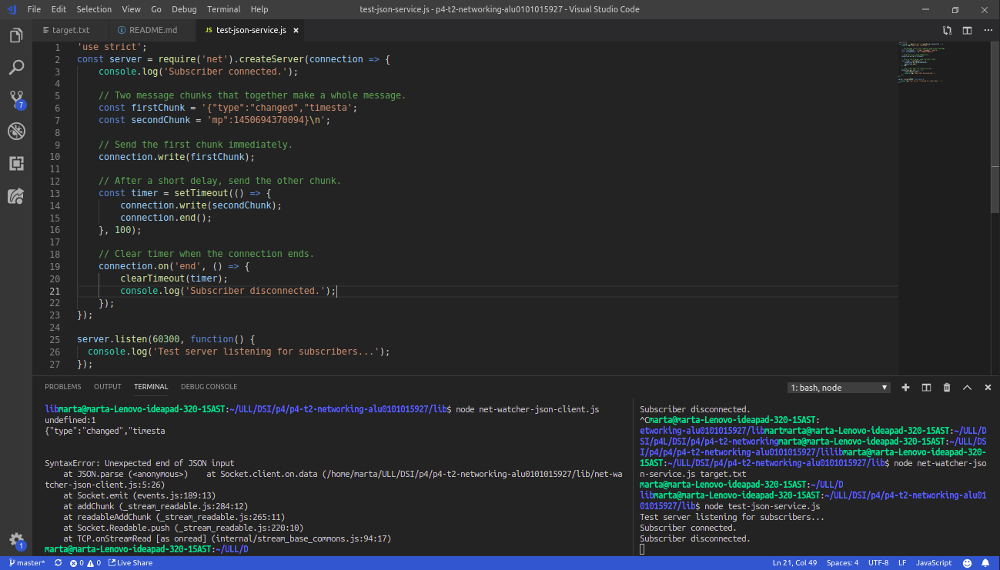

# p4-t2-networking-alu0101015927
p4-t2-networking-alu0101015927 created by GitHub Classroom

Apuntes del capíturo 3, Node.js 8 the Right way.

## Redes con Sockets

Node.js fue diseñado desde cero para hacer programación en red.  Los sockets TCP forman la columna vertebral de las aplicaciones en red modernas. 

 ### Escucha de conexiones por Sockets
 
 Escucha de conexiones de zócalo

Los servicios en red existen para hacer dos cosas: conectar puntos finales y transmitir información entre ellos. No importa qué tipo de información se transmita, primero se debe hacer una conexión.

#### Enlazando un servidor a un puerto TCP
 
Las conexiones de socket TCP constan de dos puntos finales. Un punto extremo se enlaza a un puerto numerado, mientras que el otro punto extremo se conecta a un puerto.
 
En Node.js, las operaciones de enlace y conexión son proporcionadas por el módulo net. El enlace de un puerto TCP para escuchar conexiones es de la siguiente manera:

El método net.createServer toma una función de devolución de llamada y devuelve un objeto Servidor. Node.js invocará la función de devolución de llamada cuando se conecte otro punto final. El parámetro de conexión es un objeto Socket que puede utilizar para enviar o recibir datos.

Al llamar a server.listen se une el puerto especificado. En este caso, estamos vinculando el número de puerto TCP 60300.

Nuestro programa de servidor no hace nada con la conexión todavía. Vamos a arreglar eso usándolo para enviar alguna información útil al cliente.

#### Escribiendo datos por un Socket 

Crearemos un directorio llamado networking para guardar el código que escribiremos. Luego en el editor escribiremos lo siguiente:

Podemos ver que en la parte superior hemos incluido los módulos principales de Node.js fs y net.

El nombre del archivo a observar, si se proporcionase, sería el tercer argumento (índice 2) en process.argv. Si el usuario no proporcionase un archivo lanzamos un Error personalizado. Los errores no detectados harán que el proceso Node.js se detenga después de enviar un seguimiento de pila a un error estándar.

Si miramos la función createServer podemos ver que su llamada devuelve tres cosas:

- Informa que la conexión se ha establecido (tanto para el cliente con connection.write como para la consola).
- Comienza a escuchar los cambios en el archivo de destino, guardando el objeto de observador devuelto. Esta devolución de llamada envía información de cambio al cliente usando connection.write.
- Escucha el evento de cierre de la conexión para poder informar que el suscriptor se ha desconectado y dejar de ver el archivo, con watcher.close.

Finalmente, la devolución de llamada pasa a server.listen al final. Node.js invoca esta función después de que haya enlazado con éxito el puerto 60300 y esté listo para comenzar a recibir conexiones.

#### Conectandonos a un Servidor Socket TCP con Netcat 

Para ejecutar y probar el programa net-watcher, necesitará tres sesiones de terminal: una para el servicio en sí, una para el cliente y otra para activar los cambios en el archivo visto.

En la primera terminal usamos el comando watch para tocar el archivo de destino a intervalos de un segundo.

 	​$ ​​watch​​ ​​-n​​ ​​1​​ ​​touch​​ ​​target.txt​

Mientras esto se ejecuta, en la segunda terminal ejecutamos el programa net-watcher:

	​$ ​​node​​ ​​net-watcher.js​​ ​​target.txt​ ​ 	Listening for subscribers...

Este programa crea un servicio escuchando en el puerto TCP 60300. Para conectarnos a él usaremos netcat, un programa que utiliza socket. Abrimos una tercera terminal y usamos el comando nc:

 	​$ ​​nc​​ ​​localhost​​ ​​60300​
	​ Now watching "target.txt" for changes...
	​ File changed: Wed Dec 16 2015 05:56:14 GMT-0500 (EST)
	​ File changed: Wed Dec 16 2015 05:56:19 GMT-0500 (EST)

si en tu sistema no tienes nc puedes usar telnet:

 	​$ ​​telnet​​ ​​localhost​​ ​​60300​
	​ Trying 127.0.0.1...
	​ Connected to localhost.
	​ Escape character is '^]'.
	​ Now watching "target.txt" for changes...
	​ File changed: Wed Dec 16 2015 05:56:14 GMT-0500 (EST)
	​ File changed: Wed Dec 16 2015 05:56:19 GMT-0500 (EST)
	​ ^]
	​ ​telnet>​​ ​​quit​
	​ Connection closed.

En la terminal de net-watcher se verá el mensaje Subscriber connected.
Puede matar la sesion de nc con Ctrl-c. Si estas usando telnet, Ctrk-] y luego quit. Podrás ver que en la terminal de net-watcher aparece	Subscriber disconnected.

Para terminar el servicio net-watcher o el comando watch usamos Ctrl-c.

Múltiples subscriptores podrán conectarse y recibir actualizaciones simultaneamente. Si abrimos una terminal y nos comectamos al mismo puerto con nc recibiremos las actualizaciones cuando el fichero se cambie.

Los sockets TCP son útiles para la comunicación entre equipos conectados en red. Pero si necesita procesos en la misma computadora para comunicarse, los sockets Unix ofrecen una alternativa más eficiente. El módulo de red también puede crear este tipo de socket.

#### Escuchando en Sockets Unix 

Modificaremos el programa net-watcher para ver como funciona el módulo de red que usan los sockets de Unix.
Estos solo funcionan en entornos similares a Unix.

Cambianos .linten por .listen('/tmp/watcher.sock', () => console.log('Listening for subscribers...'));

Si obtiene un error que contiene EADDRINUSE, es posible que deba eliminar watcher.sock antes de ejecutar el programa nuevamente.

Para conectar un cliente podemos usar nc pero esta vez especificando la marca -U para usar el archivo de socket.

Los sockets Unix pueden ser más rápidos que los sockets TCP porque no requieren invocar hardware de red. Sin embargo, por naturaleza están confinados a la máquina.

### Implementando un protocolo de mensajeria

Un protocolo es un conjunto de reglas que define cómo se comunican los puntos finales en un sistema. Cada vez que desarrolle una aplicación en red en Node.js, estará trabajando con uno o más protocolos. Crearemos un protocolo basado en pasar mensajes JSON a través de TCP.

JSON es increíblemente frecuente en Node.js. Lo utilizaremos ampliamente para la serialización y configuración de datos. Es mucho más fácil programar a los clientes en comparación con el texto simple, y aún es legible para los humanos.

Implementaremos puntos finales de cliente y servidor que usen nuestro nuevo protocolo basado en JSON. Esto nos dará la oportunidad de desarrollar casos de prueba y refactorizar nuestro código en módulos reutilizables.

#### Serialización de mensajes JSON

Vamos a desarrollar el protocolo de paso de mensajes que utiliza JSON para serializar los mensajes. Cada mensaje es un objeto serializado JSON, que es un hash de pares clave-valor. Aquí hay un ejemplo de objeto JSON con dos pares clave-valor:

	{"Clave": "valor", "anotherKey": "anotherValue"}

El servicio net-watcher que hemos estado desarrollando envía dos tipos de mensajes que necesitamos convertir a JSON:

 - Cuando se establece la conexión por primera vez, el cliente recibe la cadena.  
 Ahora mira "target.txt" para ver si hay cambios ...

 - Cuando el archivo de destino cambia, el cliente recibe una cadena como esta: 
 Archivo cambiado: viernes 18 de diciembre de 2015 05:44:00 GMT-0500 (EST).

Codificaremos el primer tipo de mensaje de esta manera:

	{"Tipo": "viendo", "archivo": "target.txt"}

El campo de tipo indica que este es un mensaje de observación: el archivo especificado ahora se está viendo.

El segundo tipo de mensaje se codifica de esta manera:

	{"Tipo": "cambiado", "marca de tiempo": 1358175733785}

Aquí el campo de tipo anuncia que el archivo de destino ha cambiado. El campo de marca de tiempo contiene un valor entero que representa el número de milisegundos desde la medianoche del 1 de enero de 1970. Este es un formato de hora fácil para trabajar en JavaScript. Por ejemplo, puede obtener la hora actual en este formato con Date.now.

No hay saltos de línea en nuestros mensajes JSON. Aunque JSON es independiente del espacio en blanco (ignora los espacios en blanco que están fuera de los valores de cadena), nuestro protocolo utilizará nuevas líneas solo para separar los mensajes. Nos referiremos a este protocolo como JSON delimitado por líneas (LDJ).

#### Cambiando a mensajes JSON

Ahora que hemos definido un protocolo mejorado y accesible por computadora, modifiquemos el servicio de net-watcher para usarlo. Luego crearemos programas cliente que recibirán e interpretarán estos mensajes.

Nuestra tarea es usar JSON.stringify para codificar objetos de mensaje y enviarlos a través de connection.write. JSON.stringify toma un objeto de JavaScript y devuelve una cadena que contiene una representación serializada de ese objeto en forma JSON.

En nuestro programa net-watcher.js reemplazaremos la línea:

	Connection.write (`Ahora mira" $ {filename} "para ver los cambios ... \ n`);

por:

	Connection.write (JSON.stringify ({type: 'watching', file: filename)) + '\ n');

Tambien reemplazaremos la llamada a connection.write dentro del observador:

	Vigilante de const =
	Fs.watch (filename, () => connection.write (`Archivo cambiado: $ {new Date ()} \ n`));

por lo siguiente:
	
	Const watcher = fs.watch (nombre de archivo, () => connection.write (
	JSON.stringify ({type: 'changed', timestamp: Date.now ()}) + '\ n'));

Ejecutaremos este nuevo fichero de la siguiente manera: 

	$ Node net-watcher-json-service.js target.txt
	Escuchando a los suscriptores ...

Luego nos conectaremos usando netcat desde un segundo terminal:
	
	$ Nc localhost 60300
	{"Tipo": "viendo", "archivo": "target.txt"}

Cuando tocas el archivo target.txt, verás una salida como esta de tu cliente:
	
	{"Tipo": "cambiado", "marca de tiempo": 1450437616760}

Ahora estamos listos para escribir un programa cliente que procesa estos mensajes.

### Creación de conexiones Cliente Socket

Escribiremos un programa cliente en Node.js para recibir mensajes JSON de nuestro programa net-watcher-json-service. 

Este programa utiliza net.connect para crear una conexión de cliente al puerto 60300 de localhost, luego espera los datos. El objeto cliente es un Socket, al igual que la conexión entrante que vimos en el lado del servidor.

Cada vez que ocurre un evento de datos, nuestra función de devolución de llamada toma el objeto de búfer entrante, analiza el mensaje JSON y luego registra un mensaje apropiado en la consola.

Para ejecutar el programa, primero ejecutamos net-watcher-json-service. Luego, en otro terminal, ejecutamos el cliente:

	​$ ​​node​​ ​​net-watcher-json-client.js​  
	​ Now watching: target.txt

Si tocamos el archivo de destino, la salida será como esta:

	​ File changed: Mon Dec 21 2015 05:34:19 GMT-0500 (EST)

Este programa funciona pero solo escucha eventos de datos, no eventos finales o eventos de error. Podríamos escuchar estos eventos y tomar las medidas apropiadas cuando ocurren.

### Probando la funcionalidad de la aplicación de red

Las pruebas funcionales nos aseguran que nuestro código hace lo que esperamos que haga. 

#### Entendiendo el problema del límite del mensaje

Cuando desarrollamos programas en red en Node.js, a menudo se comunican pasando mensajes. En el mejor de los casos, un mensaje llegará a la vez. Pero a veces los mensajes llegarán en pedazos, divididos en distintos eventos de datos. Para desarrollar aplicaciones en red, debemos lidiar con estas divisiones cuando ocurran.

El protocolo LDJ que desarrollamos anteriormente separa los mensajes con caracteres de nueva línea (\n). Cada carácter de nueva línea es el límite entre dos mensajes.

En el servicio que hemos estado desarrollando cada vez que ocurre un cambio, codifica y envía un mensaje a la conexión, incluida la nueva línea final. Cada línea de salida corresponde a un solo evento de datos en el cliente conectado. O, para decirlo de otra manera, los límites del evento de datos coinciden exactamente con los límites del mensaje.

Nuestro programa de cliente actualmente se basa en este comportamiento. Analiza cada mensaje enviando el contenido del búfer de datos directamente a JSON.parse:

	Cliente.on ('datos', datos => {
	Mensaje const = JSON.parse (datos);

Pero un mensaje se puede dividir por la mitad y llegar como dos eventos de datos separados, sobre todo si se trata de un mensaje grande. 

#### Implementando un servicio de prueba

Escribir aplicaciones robustas de Node.js requiere manejar problemas de red como entradas divididas, conexiones rotas y datos erróneos. Implementaremos un servicio de prueba que divide un mensaje a propósito en múltiples partes:

Lo ejecutaremos de la siguiente manera:

	​ ​$ ​​node​​ ​​test-json-service.js​
	​ Test server listening for subscribers...

Este servicio de prueba difiere de nuestro anterior net-watcher-json-service.js en algunos aspectos. En lugar de configurar un observador del sistema de archivos, como hicimos para el servicio real, aquí solo enviamos el primer fragmento predeterminado de inmediato.

Luego configuramos un temporizador para enviar el segundo fragmento después de un breve retraso. La función de JavaScript setTimeout toma dos parámetros: una función para invocar y una cantidad de tiempo en milisegundos. Después de la cantidad de tiempo especificada, la función será llamada.

Finalmente, cada vez que finaliza la conexión, usamos clearTimeout para cancelar la programación de la devolución de llamada. No es necesario programar la devolución de llamada porque una vez que se cierra la conexión, cualquier llamada a connection.write desencadenará eventos de error.

Finalmente, averigüemos qué sucede cuando nos conectamos con el programa cliente:

 	​$ ​​node​​ ​​net-watcher-json-client.js​
	​ undefined:1
	​ {"type":"changed","timesta
	​                    ^
	​ 
	​ SyntaxError: Unexpected token t
	​     at Object.parse (native)
	​     at Socket.<anonymous> (./net-watcher-json-client.js:6:22)
	​     at emitOne (events.js:77:13)
	​     at Socket.emit (events.js:169:7)
	​     at readableAddChunk (_stream_readable.js:146:16)
	​     at Socket.Readable.push (_stream_readable.js:110:10)
	​     at TCP.onread (net.js:523:20)

El error 'Unexpected token t' nos dice que el mensaje no fue completo y JSON válido. Nuestro cliente intentó enviar la mitad de un mensaje a JSON.parse, que solo espera cadenas JSON completas y con el formato correcto como entrada.

Hemos simulado con éxito el caso de un mensaje dividido proveniente del servidor. 

